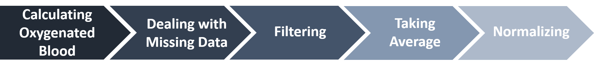

# Machine_Learning_Practice_Tourette_Syndrome

## Reference
These data are collected by Yu-Jiun Chen in National Taiwan University Hospital Hsin-Chu Branch.  
For the detail of this experiment, please read Yu-Jiun Chen's master thesis.

---

## Content
1. About
2. Data Information 
3. Code Information
    1. Data Preprocess
    2. Feature Extraction
    3. Machine Learning

---
## About
- In this study, we apply neurofeedback training  based on functional near-infrared spectroscopy as the behavior therapy for TS patients, and last for 8 weeks.  

- Yale global tic severity scale (YGTSS) is applyed in the first and last week to evaluate the improvment of patients, the mild group and severe group is bounded by score of 25.

- The classification machine leaning model helps us the figure out the differences between mild group and severe group.

## Data Information

### Data Information of Patients
The anonymous patient list is saved in `patient_list.csv`

| Column name | Details |
| --- | --- |
| Case | Case number|
| Age | Age
| Pre-test | The YGTSS score\* in first week |
| Post-test | The YGTSS score in eighth week |

\* Severe and mild group are bounded by 25. 

### Data information for NIRS Files
The files are placed by the case number, `usually` two files for each case. Check it by yourself.

\#Useful columns

| Column name | Details |
| --- | --- |
| Time_Host | Time |
| CH1_PD730 | The intensity in ch1 at 730nm, range in 0 to 4095 |
| CH1_PD850 | The intensity in ch1 at 850nm, range in 0 to 4095 |
| CH2_PD730 | The intensity in ch2 at 730nm, range in 0 to 4095 |
| CH2_PD850 | The intensity in ch2 at 850nm, range in 0 to 4095 |
| CH3_PD730 | The intensity in ch3 at 730nm, range in 0 to 4095 |
| CH3_PD850 | The intensity in ch3 at 850nm, range in 0 to 4095 |
| CH4_PD730 | The intensity in ch4 at 730nm, range in 0 to 4095 |
| CH4_PD850 | The intensity in ch4 at 850nm, range in 0 to 4095 |
| trail_times | Number of trails, 32 in total |

---

## Code Information
1. Data Preprocess

        
2. Feature Extraction
    - stage average
    - average difference 
    - stage peak
    - stage activation 
    - begin slope (trail, rest)
    - stadard deviation
    - stadard deviation difference 
3. Machine Learning

